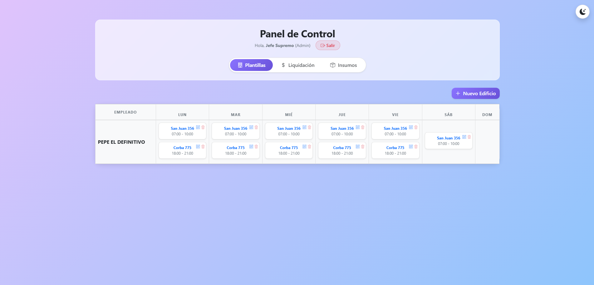
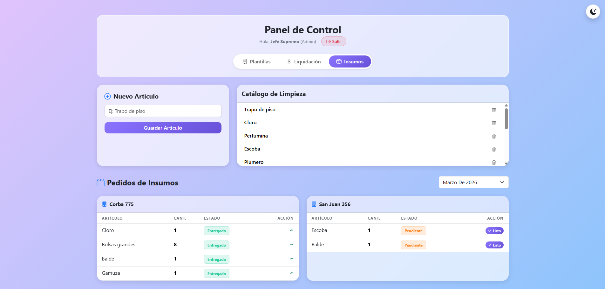
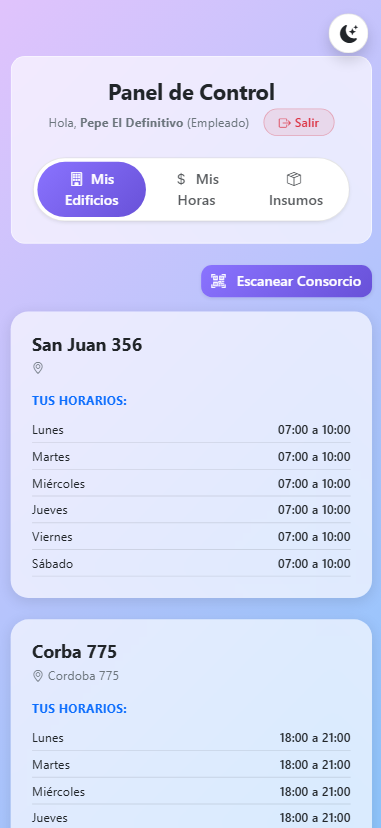
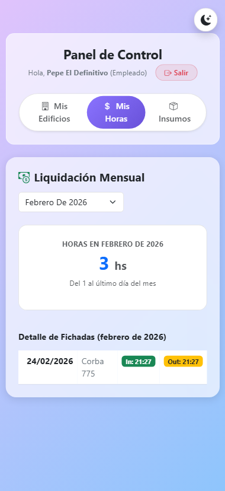
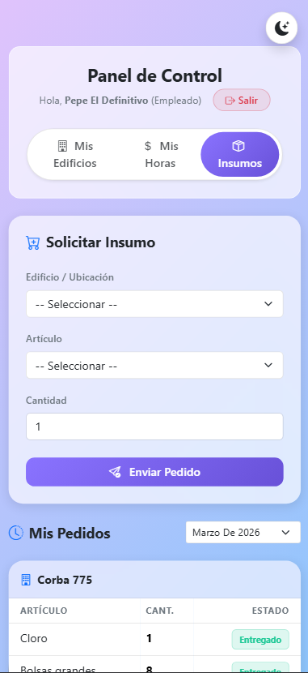

# Sistema de Gestion de Consorcios y Control de Asistencia

Plataforma integral ERP para la administracion de servicios de limpieza en edificios, control de personal mediante validacion geografica y gestion de suministros.

## Descripcion del Proyecto

Este sistema fue desarrollado para optimizar la coordinacion entre la administracion y el personal operativo. Permite el seguimiento en tiempo real de las tareas de mantenimiento, garantizando la presencia del personal en el lugar asignado a traves de herramientas de geolocalizacion y escaneo de codigos QR.

## Capturas de Pantalla

A continuacion se presentan las interfaces principales del sistema:

### Vista del Dashboard (Panel de Control)

*Descripcion: Vista principal del administrador con la matriz de horarios semanal.*

### Liquidacion de Horas

*Descripcion: Modulo de calculo automatico de haberes basado en horas registradas.*

### Gestion de Insumos

*Descripcion: Listado de pedidos y catalogo de articulos de limpieza.*

### Interfaz Mobile (Perspectiva del Empleado)

La aplicacion esta diseñada bajo una filosofia Mobile-First para facilitar el uso del personal en los edificios.

| Escaneo de QR y GPS | Listado de Edificios Asignados | Pedidos de Insumos |
| :---: | :---: | :---: |
|  |  |  |
| *Validacion de presencia en sitio* | *Consulta de cronograma personal* | *Gestion de stock desde el edificio* |

## Funcionalidades Principales

* **Autenticacion:** Diferenciacion de perfiles (Administrador / Empleado) con persistencia en localStorage.
* **Matriz de Horarios:** Visualizacion de cronogramas asignados por empleado y dia de la semana.
* **Geofencing:** Validacion de fichaje solo si el usuario se encuentra en un radio menor a 200 metros del edificio.
* **Gestion de Pedidos:** Sistema de solicitud de materiales con agrupacion por edificio para facilitar la logistica.
* **Modo Adaptativo:** Implementacion de temas claro y oscuro basado en preferencias del usuario.

## Requisitos Tecnicos

* Angular 17.0.0+
* Node.js 18.x+
* Bootstrap 5.3+
* Bibliotecas adicionales: angularx-qrcode, ngx-scanner, sweetalert2.

## Instalacion

1. Clonar el repositorio:
   git clone https://github.com/usuario/nombre-del-proyecto.git

2. Instalar las dependencias de npm:
   npm install

3. Iniciar el servidor de desarrollo:
   ng serve

4. Acceder en el navegador a:
   http://localhost:4200

## Licencia

Este proyecto es para uso educativo y profesional. Consulte el archivo LICENSE para mas detalles.